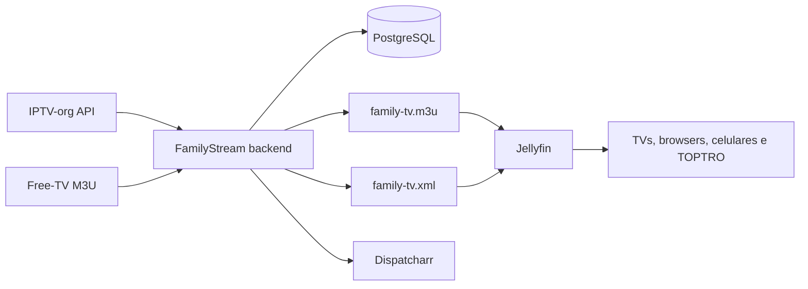

# FamilyStream Hub

FamilyStream Hub é uma camada de descoberta, seleção, classificação e publicação de canais IPTV públicos/autorizados para consumo familiar através do Jellyfin. Ele não substitui o Jellyfin: importa metadados e streams, aplica blocklist, deduplica canais, calcula uma pontuação de qualidade e publica uma playlist M3U e um XMLTV compatíveis.

> O projeto não contorna DRM, autenticação, tokens privados, geoblocking ou restrições de licença. Uma URL gratuita para assistir não implica direito de redistribuição.

## Android TV — instalação rápida pelo Downloader

Código oficial do **Downloader by AFTVnews** para a build Android TV de desenvolvimento:

```text
6093932
```

Short URL:

```text
https://aftv.news/6093932
```

O código aponta para o asset estável `FamilyStream-AndroidTV-latest.apk`. O CI substitui esse arquivo a cada nova build publicada na release `android-tv-dev`, portanto o código pode continuar o mesmo entre versões de desenvolvimento.

URL de destino permanente:

```text
https://github.com/frittcat/IPTV/releases/download/android-tv-dev/FamilyStream-AndroidTV-latest.apk
```

## Arquitetura



A v0.2 fornece um backend executável com PostgreSQL, migrações aditivas, API FastAPI paginada, sincronização IPTV-org e Free-TV, blocklist DMCA/NSFW, health check HLS controlado, publicação somente após health, primary/fallback via proxy estável, geração M3U/XMLTV com ElementTree, scheduler, autenticação administrativa, CI e relatórios. O catálogo VOD possui providers para Archive.org, Wikimedia Commons, NASA, M3U autorizado e Xtream legítimo, com direitos, deduplicação, STRM e proxy Range sem cache permanente de vídeo. A criação de objetos internos do Dispatcharr depende do Swagger da versão instalada; quando ele não está acessível, o backend informa a limitação em vez de enviar chamadas especulativas.

## Requisitos

É necessário ter Windows 10/11, Docker Desktop com Compose, Git e uma instalação funcional do Jellyfin. O servidor deve permanecer acessível na rede local. Para o TOPTRO, prefira reprodução direta HLS/H.264/AAC e deixe o transcode como fallback do Jellyfin.

## Instalação rápida no Windows

```powershell
git clone https://github.com/frittcat/IPTV.git
cd IPTV
.\scripts\install.ps1
```

Depois, acesse `http://localhost:8080/docs` para a API e `http://localhost:9191` para o Dispatcharr. A primeira sincronização deve ser feita por `POST http://localhost:8080/api/sync` com autenticação administrativa. As saídas compatíveis com Jellyfin ficam em `http://localhost:8080/family-tv.m3u` e `http://localhost:8080/family-tv.xml`.

## Configuração do Jellyfin

No painel administrativo, abra **Live TV**, adicione um tuner do tipo **M3U Tuner** e informe a URL da playlist. Em seguida, adicione um provedor de guia do tipo **XMLTV** e informe a URL XMLTV. O Jellyfin permite limitar streams simultâneos, usar User-Agent e configurar auto-loop conforme a necessidade do cliente [1].

Se preferir o Dispatcharr como camada de proxy e failover, abra a interface em `http://localhost:9191`, crie a conta local, importe a M3U/XMLTV ou as fontes autorizadas, crie os canais e copie as URLs M3U/EPG exibidas por ele. O guia oficial confirma suporte a M3U, XMLTV, HDHomeRun e múltiplos streams por canal [2].

## Endpoints

| Endpoint | Função |
|---|---|
| `/health` | Verificação de disponibilidade |
| `/api/stats` | Métricas de canais, streams e EPG |
| `/api/channels` | Busca e filtros de canais |
| `POST /api/sync` | Sincronização real de Live TV |
| `GET /api/health-check?limit=20` | Health check controlado |
| `POST /api/v1/vod/sync` | Sincronização VOD autorizada |
| `GET /api/v1/vod` | Catálogo VOD paginado |
| `GET /vod/stream/{id}` | Proxy VOD estável com Range |
| `GET /api/v1/dispatcharr/status` | Descoberta do Swagger/estado do Dispatcharr |
| `/api/report` | Geração de relatório JSON/Markdown |
| `/family-tv.m3u` | Playlist publicada para Jellyfin/Dispatcharr |
| `/family-tv.xml` | XMLTV básico compatível |
| `/docs` | Documentação OpenAPI interativa |

## Atualização e backup

```powershell
.\scripts\update.ps1
.\scripts\backup.ps1
.\scripts\test.ps1
```

Não coloque `.env`, API keys, senhas, cookies, sessões ou credenciais IPTV no Git. O arquivo `.env.example` contém somente nomes e valores de demonstração.

## Validação e limitações conhecidas

A suíte local possui 54 testes aprovados e a compilação Python foi validada. O smoke test real do Archive.org respondeu com metadata e URLs remotas. Wikimedia respondeu com rate limiting durante o teste de sessão e NASA não retornou itens de vídeo naquele momento; o código trata essas respostas como falha/ausência, sem declarar sucesso. Docker não está disponível no ambiente desta sessão, portanto o build e a execução dos containers estão cobertos pelo GitHub Actions, mas não foram runtime validated localmente. A configuração automática de objetos Dispatcharr continua condicionada ao Swagger da versão instalada, e a atualização automática da biblioteca Jellyfin depende de `JELLYFIN_URL` e `JELLYFIN_API_KEY`.

## Fontes e licenças

Consulte [`docs/SOURCES.md`](docs/SOURCES.md) e [`data/licenses.json`](data/licenses.json). A API IPTV-org documenta os campos de canais, streams, logos, guias e blocklist [3]. O projeto Dispatcharr é distribuído sob AGPL-3.0 [4].

## Referências

[1]: https://jellyfin.org/docs/general/server/live-tv/setup-guide/ "Jellyfin Live TV Setup Guide"
[2]: https://dispatcharr.github.io/Dispatcharr-Docs/getting-started/ "Dispatcharr Getting Started"
[3]: https://github.com/iptv-org/api "IPTV-org API"
[4]: https://github.com/Dispatcharr/dispatcharr "Dispatcharr repository and license"
