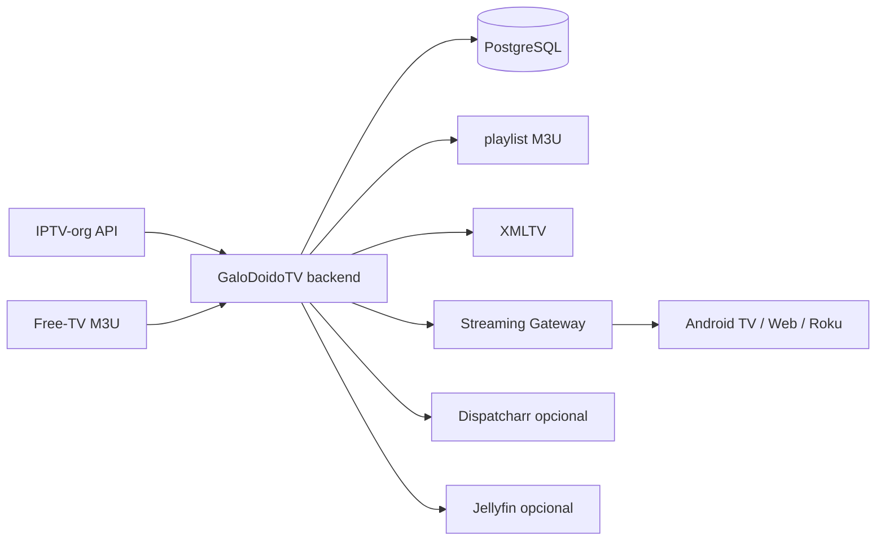

# GaloDoidoTV

GaloDoidoTV é uma plataforma própria de Live TV, filmes e séries, com descoberta, seleção, classificação, publicação e reprodução de conteúdo público/autorizado. O backend aplica blocklist, deduplica canais, calcula qualidade/saúde, publica APIs próprias e mantém Jellyfin/Dispatcharr apenas como integrações opcionais.

> O projeto não contorna DRM, autenticação, tokens privados, geoblocking ou restrições de licença. Uma URL gratuita para assistir não implica direito de redistribuição.

## Android TV — instalação rápida pelo Downloader

Código oficial do **Downloader by AFTVnews** para a build Android TV de desenvolvimento:

```text
6093932
```

Short URL:

```text
https://aftv.news/6093932
```

O aplicativo instalado e toda a identidade visual ativa usam o nome **GaloDoidoTV**. O CI publica o asset principal `GaloDoidoTV-AndroidTV-latest.apk`. Para manter o código Downloader `6093932` funcionando sem precisar gerar outro código, a release também mantém temporariamente um alias de compatibilidade com o antigo nome de arquivo.

URL principal atual:

```text
https://github.com/frittcat/IPTV/releases/download/android-tv-dev/GaloDoidoTV-AndroidTV-latest.apk
```

## Arquitetura



A v0.3 adiciona Playback Resolver por dispositivo, Streaming Gateway, HLS rewrite, Range/206, Media Probe/ffprobe, health history, failover e cliente Android TV próprio com navegação por controle remoto. O catálogo VOD possui providers para Archive.org, Wikimedia Commons, NASA, M3U autorizado e Xtream legítimo, com direitos e deduplicação. Dispatcharr e Jellyfin permanecem como adaptadores opcionais durante a transição para a plataforma própria.

## Requisitos

É necessário ter Windows 10/11, Docker Desktop com Compose e Git. O servidor deve permanecer acessível na rede local para os clientes de TV.

## Instalação rápida no Windows

```powershell
git clone https://github.com/frittcat/IPTV.git
cd IPTV
git checkout v0.3-platform
.\scripts\install.ps1
```

Depois, acesse `http://localhost:8080/docs` para a API e `http://localhost:9191` para o Dispatcharr opcional. A sincronização inicial pode ser feita com `./scripts/sync-now.ps1`.

## Endpoints

| Endpoint | Função |
|---|---|
| `/health` | Verificação de disponibilidade |
| `/api/stats` | Métricas de canais, streams e EPG |
| `/api/v1/home` | Home unificada para os clientes |
| `/api/v1/live/channels` | Catálogo Live TV |
| `/api/v1/catalog/movie` | Catálogo de filmes |
| `/api/v1/catalog/series` | Catálogo de séries |
| `/api/v1/search` | Busca unificada |
| `/api/v1/playback/resolve/{kind}/{id}` | Resolver de reprodução por dispositivo |
| `/api/v1/play/live/{id}` | Playback Live pelo gateway |
| `/api/v1/play/vod/{id}` | Playback VOD pelo gateway |
| `/api/report` | Relatório JSON/Markdown |
| `/docs` | Documentação OpenAPI interativa |

## Atualização e backup

```powershell
.\scripts\update.ps1
.\scripts\backup.ps1
.\scripts\test.ps1
```

Não coloque `.env`, API keys, senhas, cookies, sessões ou credenciais IPTV no Git. O arquivo `.env.example` contém somente nomes e valores de demonstração.

## Fontes e licenças

Consulte [`docs/SOURCES.md`](docs/SOURCES.md) e [`data/licenses.json`](data/licenses.json). A API IPTV-org documenta canais, streams, logos, guias e blocklist. O Dispatcharr é uma integração opcional distribuída sob AGPL-3.0.
