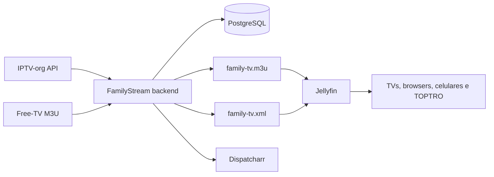

# FamilyStream Hub

FamilyStream Hub é uma camada de descoberta, seleção, classificação e publicação de canais IPTV públicos/autorizados para consumo familiar através do Jellyfin. Ele não substitui o Jellyfin: importa metadados e streams, aplica blocklist, deduplica canais, calcula uma pontuação de qualidade e publica uma playlist M3U e um XMLTV compatíveis.

> O projeto não contorna DRM, autenticação, tokens privados, geoblocking ou restrições de licença. Uma URL gratuita para assistir não implica direito de redistribuição.

## Arquitetura



A versão inicial fornece um backend executável com PostgreSQL, API FastAPI, sincronização IPTV-org, blocklist DMCA/NSFW, deduplicação por ID e nome normalizado, pontuação de qualidade, publicação por limiar, geração de M3U/XMLTV, relatórios e scripts PowerShell. A integração operacional com Dispatcharr é documentada porque a criação de contas e a configuração final dependem do ambiente do usuário.

## Requisitos

É necessário ter Windows 10/11, Docker Desktop com Compose, Git e uma instalação funcional do Jellyfin. O servidor deve permanecer acessível na rede local. Para o TOPTRO, prefira reprodução direta HLS/H.264/AAC e deixe o transcode como fallback do Jellyfin.

## Instalação rápida no Windows

```powershell
git clone https://github.com/frittcat/IPTV.git
cd IPTV
.\scripts\install.ps1
```

Depois, acesse `http://localhost:8080/docs` para a API e `http://localhost:9191` para o Dispatcharr. A primeira sincronização pode ser iniciada em `http://localhost:8080/api/sync`. As saídas compatíveis com Jellyfin ficam em `http://localhost:8080/family-tv.m3u` e `http://localhost:8080/family-tv.xml`.

## Configuração do Jellyfin

No painel administrativo, abra **Live TV**, adicione um tuner do tipo **M3U Tuner** e informe a URL da playlist. Em seguida, adicione um provedor de guia do tipo **XMLTV** e informe a URL XMLTV. O Jellyfin permite limitar streams simultâneos, usar User-Agent e configurar auto-loop conforme a necessidade do cliente [1].

Se preferir o Dispatcharr como camada de proxy e failover, abra a interface em `http://localhost:9191`, crie a conta local, importe a M3U/XMLTV ou as fontes autorizadas, crie os canais e copie as URLs M3U/EPG exibidas por ele. O guia oficial confirma suporte a M3U, XMLTV, HDHomeRun e múltiplos streams por canal [2].

## Endpoints

| Endpoint | Função |
|---|---|
| `/health` | Verificação de disponibilidade |
| `/api/stats` | Métricas de canais, streams e EPG |
| `/api/channels` | Busca e filtros de canais |
| `/api/sync` | Sincronização real da API IPTV-org |
| `/api/report` | Geração de relatório JSON/Markdown |
| `/family-tv.m3u` | Playlist publicada para Jellyfin/Dispatcharr |
| `/family-tv.xml` | XMLTV básico compatível |
| `/docs` | Documentação OpenAPI interativa |

## Atualização e backup

```powershell
.\scripts\update.ps1
.\scripts\backup.ps1
.\scripts\test.ps1
```

Não coloque `.env`, API keys, senhas, cookies, sessões ou credenciais IPTV no Git. O arquivo `.env.example` contém somente nomes e valores de demonstração.

## Limitações conhecidas da primeira versão

A importação estruturada principal está implementada para IPTV-org. O endpoint de sincronização já preserva URL, feed, título, referrer, user-agent, qualidade e label; a importação incremental do Free-TV, o health check HLS com ffprobe, a interface administrativa visual e a automação de configuração da API do Jellyfin são as próximas extensões. O XMLTV inicial publica o mapa de canais e será enriquecido quando forem incorporados feeds XMLTV autorizados.

## Fontes e licenças

Consulte [`docs/SOURCES.md`](docs/SOURCES.md) e [`data/licenses.json`](data/licenses.json). A API IPTV-org documenta os campos de canais, streams, logos, guias e blocklist [3]. O projeto Dispatcharr é distribuído sob AGPL-3.0 [4].

## Referências

[1]: https://jellyfin.org/docs/general/server/live-tv/setup-guide/ "Jellyfin Live TV Setup Guide"
[2]: https://dispatcharr.github.io/Dispatcharr-Docs/getting-started/ "Dispatcharr Getting Started"
[3]: https://github.com/iptv-org/api "IPTV-org API"
[4]: https://github.com/Dispatcharr/dispatcharr "Dispatcharr repository and license"
